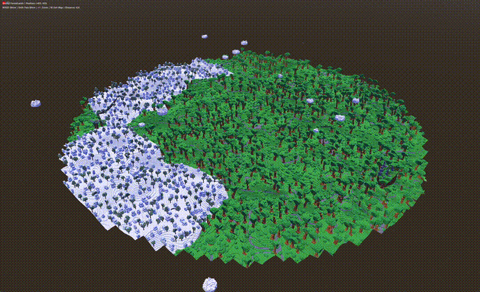

# CubeGen - Procedurally Generated Voxel RPG

This is a procedurally generated 3D voxel RPG inspired by Cubeworld, built using C# inside of Godot 4.4. The game features a fully procedurally generated world including infinite terrain, biomes, and weather systems.

## Features

- **Infinite Terrain Generation**: Chunk-based world loading system using noise algorithms.
- **Diverse Biomes**: Forest, Plains, Desert, Mountains, Tundra, supported by a sub-region system.
- **Dynamic Environment**:
  - Procedural Cloud generation.
  - Wind system affecting foliage and environment.
- **Fauna & Life**:
  - Bird flocking and spawning system.
  - General Fauna spawner infrastructure.
- **Detailed Decoration**: Logic for placing decoration clusters (foliage, rocks, trees).
- **Player Controller**:
  - Voxel-based character rendering.
  - Standard movement (WASD + Jump).

## Project Structure

- `src/World/Generation`: World generation logic (Biomes, Regions, Decoration Clusters).
- `src/World/Chunks`: Chunk management and mesh generation.
- `src/World/Environment`: Environmental systems (Clouds, Wind).
- `src/World/Fauna`: Animal behaviors and spawning (Birds).
- `src/World/Materials`: Shader and material management.
- `src/Player`: Player controller and Voxel Character logic.
- `src/UI`: User Interface elements.
- `src/Utils`: Utility classes.

## Getting Started

### Prerequisites

- [Godot 4.4](https://godotengine.org/) (.NET version required)
- [.NET 8.0 SDK](https://dotnet.microsoft.com/download/dotnet/8.0)

### Installation & Running

1. Clone the repository.
2. Open the project folder in Godot 4.4.
3. Godot should automatically build the C# solution. If not, click "Build" in the top right.
4. Run the main scene (usually `World.tscn` or defined in Project Settings).
5. Use **F5** to play the main scene.

### Controls

- **W, A, S, D**: Move
- **Space**: Jump
- **Mouse**: Look around
- **Escape**: Toggle mouse capture

## Development Status

This project is in active development.

### Current Features
- Infinite procedural terrain with multiple biomes.
- Atmospheric effects (Clouds, Wind).
- Basic fauna (Birds).
- Player movement and character rendering.

### Planned Features
- Towns and points of interest.
- RPG elements (Inventory, attributes, quests).
- Advanced combat system.
- Expanded fauna and interactions.
- Improved visual shaders.
